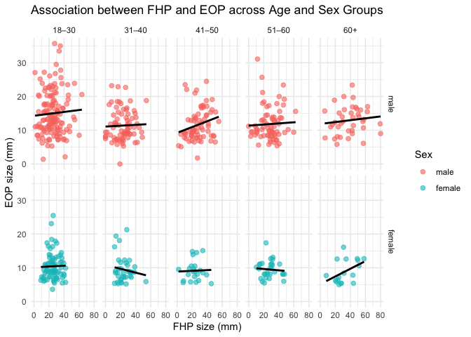

p8105_mtp_yz5248
================
yz5248
2025-10-18

``` r
library(readxl)
library(tidyverse)
```

    ## ── Attaching core tidyverse packages ──────────────────────── tidyverse 2.0.0 ──
    ## ✔ dplyr     1.1.4     ✔ readr     2.1.5
    ## ✔ forcats   1.0.0     ✔ stringr   1.5.1
    ## ✔ ggplot2   4.0.0     ✔ tibble    3.2.1
    ## ✔ lubridate 1.9.4     ✔ tidyr     1.3.1
    ## ✔ purrr     1.0.2     
    ## ── Conflicts ────────────────────────────────────────── tidyverse_conflicts() ──
    ## ✖ dplyr::filter() masks stats::filter()
    ## ✖ dplyr::lag()    masks stats::lag()
    ## ℹ Use the conflicted package (<http://conflicted.r-lib.org/>) to force all conflicts to become errors

``` r
library(knitr)
library(janitor)
```

    ## 
    ## Attaching package: 'janitor'
    ## 
    ## The following objects are masked from 'package:stats':
    ## 
    ##     chisq.test, fisher.test

``` r
library(lubridate)  
library(patchwork)
```

# Importing and tiding data

``` r
raw_df = 
  read_excel("p8105_mtp_data.xlsx", skip = 7) |>  
  janitor::clean_names() |>                     
  mutate(
    across(where(is.numeric), ~na_if(.x, -999)),  
    sex = recode(sex, `0` = "female", `1` = "male"),
    sex = factor(sex, levels = c("male", "female")),
    age_group = case_when(
      age_group == 2 ~ "18–30",
      age_group == 3 ~ "31–40",
      age_group == 4 ~ "41–50",
      age_group == 5 ~ "51–60",
      age_group == c(6,7,8) ~ "60+",
      TRUE ~ NA_character_
    ),
    age_group = ordered(age_group,
                        levels = c("18–30", "31–40", "41–50", "51–60", "60+")),
    eop_size = case_when(
      eop_size == 0 ~ "small (0–5mm)",
      eop_size == 1 ~ "medium (5–10mm)",
      eop_size == 2:5 ~ "large (10mm+)",
      TRUE ~ NA_character_
    ),
    eop_size = ordered(eop_size, levels = c("small (0–5mm)", "medium (5–10mm)", "large (10mm+)")),
    eop_visibility_classification = recode(eop_visibility_classification,
                                           `0` = "not_visible",
                                           `1` = "partially_visible",
                                           `2` = "visible"),
    eop_visibility_classification = ordered(
      eop_visibility_classification,
      levels = c("not_visible", "partially_visible", "visible")),
    fhp_category = case_when(
      fhp_category == 0 ~ "none (0–10mm)",
      fhp_category == 1 ~ "mild (10–20mm)",
      fhp_category == 2 ~ "moderate (20–30mm)",
      fhp_category >= 3 ~ "severe (30mm+)",
      TRUE ~ NA_character_
    ),
    fhp_category = ordered(fhp_category,
                           levels = c("none (0–10mm)", "mild (10–20mm)", "moderate (20–30mm)", "severe (30mm+)")),
    eop_shape = str_to_lower(eop_shape)
  ) |> 
  select(sex, age, age_group, everything()) 
```

    ## Warning: There was 1 warning in `mutate()`.
    ## ℹ In argument: `eop_size = case_when(...)`.
    ## Caused by warning in `eop_size == 2:5`:
    ## ! longer object length is not a multiple of shorter object length

``` r
raw_df
```

    ## # A tibble: 1,221 × 9
    ##    sex      age age_group eop_size_mm eop_size  eop_visibility_class…¹ eop_shape
    ##    <fct>  <dbl> <ord>           <dbl> <ord>     <ord>                  <chr>    
    ##  1 male      18 18–30            14.8 large (1… visible                3        
    ##  2 male      26 18–30            17.1 large (1… visible                3        
    ##  3 female    22 18–30            NA   small (0… partially_visible      <NA>     
    ##  4 male      20 18–30            23.9 <NA>      visible                1        
    ##  5 female    27 18–30            NA   small (0… not_visible            <NA>     
    ##  6 female    28 18–30             7.9 medium (… visible                2        
    ##  7 female    17 <NA>              6.4 medium (… visible                1        
    ##  8 male      21 18–30             9.4 medium (… visible                2        
    ##  9 female    25 18–30            NA   small (0… not_visible            <NA>     
    ## 10 male      30 18–30            16.5 large (1… visible                2        
    ## # ℹ 1,211 more rows
    ## # ℹ abbreviated name: ¹​eop_visibility_classification
    ## # ℹ 2 more variables: fhp_size_mm <dbl>, fhp_category <ord>

``` r
n_participants <- nrow(raw_df)

age_sex_table <- raw_df |>
  filter(!is.na(age_group)) |>
  tabyl(sex, age_group) |>
  adorn_totals(where = c("row", "col")) |>
  adorn_percentages("row") |>
  adorn_pct_formatting(digits = 1) |>
  kable(caption = "Table 1. Age group distribution by sex")

n_participants
```

    ## [1] 1221

``` r
age_sex_table
```

| sex    | 18–30 | 31–40 | 41–50 | 51–60 | 60+  | Total  |
|:-------|:------|:------|:------|:------|:-----|:-------|
| male   | 30.0% | 20.2% | 20.0% | 20.0% | 9.9% | 100.0% |
| female | 29.8% | 20.2% | 20.9% | 19.6% | 9.5% | 100.0% |
| Total  | 29.9% | 20.2% | 20.5% | 19.8% | 9.7% | 100.0% |

Table 1. Age group distribution by sex

``` r
raw_df |>
  ggplot(aes(x = age)) +
  geom_histogram(binwidth = 5, fill = "skyblue", color = "white") +
  labs(title = "Age Distribution", x = "Age (years)", y = "Count")
```

<!-- -->

# Visualization

``` r
plot_df = raw_df |>
  mutate(
    eeop = eop_size == c("large (10mm+)"),
    fhp_mm = fhp_size_mm
  )

new_Figure3 = plot_df |>
  ggplot(aes(x = fhp_size_mm, fill = sex)) +
  geom_density(alpha = 0.5) +
  labs(
    title = "Distribution of Forward Head Posture (FHP) size",
    x = "FHP size (mm)",
    y = "Density",
    fill = "Sex"
  ) +
  theme_minimal(base_size = 12)
new_Figure3 
```

    ## Warning: Removed 6 rows containing non-finite outside the scale range
    ## (`stat_density()`).

<!-- -->

``` r
new_Figure4 = plot_df |>
  mutate(enlarged_eop = if_else(eop_size_mm >= 10, 1, 0)) |>
  group_by(sex, age_group) |>
  summarise(
    n = n(),
    eeop_rate = mean(enlarged_eop, na.rm = TRUE)
  ) |>
  ggplot(aes(x = age_group, y = eeop_rate, fill = sex)) +
  geom_col(position = position_dodge()) +
  geom_text(
    aes(label = scales::percent(eeop_rate, accuracy = 1)),
    position = position_dodge(width = 0.9),
    vjust = -0.5,
    size = 3
  ) +
  labs(
    title = "Prevalence of Enlarged EOP (≥10mm) by Age and Sex",
    x = "Age Group",
    y = "Proportion with Enlarged EOP (EEOP)",
    fill = "Sex"
  ) +
  theme_minimal(base_size = 12)
```

    ## `summarise()` has grouped output by 'sex'. You can override using the `.groups`
    ## argument.

``` r
new_Figure4 
```

<!-- -->

``` r
# Combine into a two-panel figure
two_panel_fig = new_Figure3 + new_Figure4 + plot_layout(ncol = 2)
two_panel_fig
```

    ## Warning: Removed 6 rows containing non-finite outside the scale range
    ## (`stat_density()`).

<!-- -->

``` r
fhp_eop_plot = raw_df |>
  ggplot(aes(x = fhp_size_mm, y = eop_size_mm, color = sex)) +
  geom_point(alpha = 0.6) +
  geom_smooth(method = "lm", se = FALSE, color = "black") +
  facet_grid(sex ~ age_group) +
  labs(title = "Association between FHP and EOP across Age and Sex Groups",
       x = "FHP size (mm)", y = "EOP size (mm)") +
  theme_minimal()

fhp_eop_plot
```

    ## `geom_smooth()` using formula = 'y ~ x'

    ## Warning: Removed 523 rows containing non-finite outside the scale range
    ## (`stat_smooth()`).

    ## Warning: Removed 523 rows containing missing values or values outside the scale range
    ## (`geom_point()`).

<!-- -->
