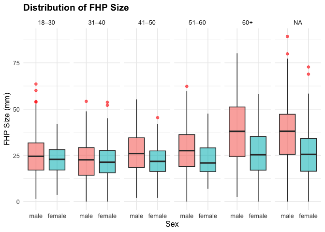

p8105_mtp_yz5248
================
yz5248
2025-10-18

``` r
library(readxl)
library(tidyverse)
```

    ## ── Attaching core tidyverse packages ──────────────────────── tidyverse 2.0.0 ──
    ## ✔ dplyr     1.1.4     ✔ readr     2.1.5
    ## ✔ forcats   1.0.0     ✔ stringr   1.5.1
    ## ✔ ggplot2   4.0.0     ✔ tibble    3.2.1
    ## ✔ lubridate 1.9.4     ✔ tidyr     1.3.1
    ## ✔ purrr     1.0.2     
    ## ── Conflicts ────────────────────────────────────────── tidyverse_conflicts() ──
    ## ✖ dplyr::filter() masks stats::filter()
    ## ✖ dplyr::lag()    masks stats::lag()
    ## ℹ Use the conflicted package (<http://conflicted.r-lib.org/>) to force all conflicts to become errors

``` r
library(knitr)
library(janitor)
```

    ## 
    ## Attaching package: 'janitor'
    ## 
    ## The following objects are masked from 'package:stats':
    ## 
    ##     chisq.test, fisher.test

``` r
library(lubridate)  
library(patchwork)
```

# Importing and tiding data

``` r
raw_df = 
  read_excel("p8105_mtp_data.xlsx", skip = 7) |>  
  janitor::clean_names() |>                     
  mutate(
    across(where(is.numeric), ~na_if(.x, -999)),  
    sex = recode(sex, `0` = "female", `1` = "male"),
    sex = factor(sex, levels = c("male", "female")),
    age_group = case_when(
      age_group == 2 ~ "18–30",
      age_group == 3 ~ "31–40",
      age_group == 4 ~ "41–50",
      age_group == 5 ~ "51–60",
      age_group == c(6,7,8) ~ "60+",
      TRUE ~ NA_character_
    ),
    age_group = ordered(age_group,
                        levels = c("18–30", "31–40", "41–50", "51–60", "60+")),
    eop_size = case_when(
      eop_size == 0 ~ "small (0–5mm)",
      eop_size == 1 ~ "medium (5–10mm)",
      eop_size == 2:5 ~ "large (10mm+)",
      TRUE ~ NA_character_
    ),
    eop_size = ordered(eop_size, levels = c("small (0–5mm)", "medium (5–10mm)", "large (10mm+)")),
    eop_visibility_classification = recode(eop_visibility_classification,
                                           `0` = "not_visible",
                                           `1` = "partially_visible",
                                           `2` = "visible"),
    eop_visibility_classification = ordered(
      eop_visibility_classification,
      levels = c("not_visible", "partially_visible", "visible")),
    fhp_category = case_when(
      fhp_category == 0 ~ "none (0–10mm)",
      fhp_category == 1 ~ "mild (10–20mm)",
      fhp_category == 2 ~ "moderate (20–30mm)",
      fhp_category >= 3 ~ "severe (30mm+)",
      TRUE ~ NA_character_
    ),
    fhp_category = ordered(fhp_category,
                           levels = c("none (0–10mm)", "mild (10–20mm)", "moderate (20–30mm)", "severe (30mm+)")),
    eop_shape = str_to_lower(eop_shape)
  ) |> 
  select(sex, age, age_group, everything()) 
```

    ## Warning: There was 1 warning in `mutate()`.
    ## ℹ In argument: `eop_size = case_when(...)`.
    ## Caused by warning in `eop_size == 2:5`:
    ## ! longer object length is not a multiple of shorter object length

``` r
raw_df
```

    ## # A tibble: 1,221 × 9
    ##    sex      age age_group eop_size_mm eop_size  eop_visibility_class…¹ eop_shape
    ##    <fct>  <dbl> <ord>           <dbl> <ord>     <ord>                  <chr>    
    ##  1 male      18 18–30            14.8 large (1… visible                3        
    ##  2 male      26 18–30            17.1 large (1… visible                3        
    ##  3 female    22 18–30            NA   small (0… partially_visible      <NA>     
    ##  4 male      20 18–30            23.9 <NA>      visible                1        
    ##  5 female    27 18–30            NA   small (0… not_visible            <NA>     
    ##  6 female    28 18–30             7.9 medium (… visible                2        
    ##  7 female    17 <NA>              6.4 medium (… visible                1        
    ##  8 male      21 18–30             9.4 medium (… visible                2        
    ##  9 female    25 18–30            NA   small (0… not_visible            <NA>     
    ## 10 male      30 18–30            16.5 large (1… visible                2        
    ## # ℹ 1,211 more rows
    ## # ℹ abbreviated name: ¹​eop_visibility_classification
    ## # ℹ 2 more variables: fhp_size_mm <dbl>, fhp_category <ord>

``` r
n_participants <- nrow(raw_df)

age_sex_table <- raw_df |>
  filter(!is.na(age_group)) |>
  tabyl(sex, age_group) |>
  adorn_totals(where = c("row", "col")) |>
  adorn_percentages("row") |>
  adorn_pct_formatting(digits = 1) |>
  kable(caption = "Table 1. Age group distribution by sex")

n_participants
```

    ## [1] 1221

``` r
age_sex_table
```

| sex    | 18–30 | 31–40 | 41–50 | 51–60 | 60+  | Total  |
|:-------|:------|:------|:------|:------|:-----|:-------|
| male   | 30.0% | 20.2% | 20.0% | 20.0% | 9.9% | 100.0% |
| female | 29.8% | 20.2% | 20.9% | 19.6% | 9.5% | 100.0% |
| Total  | 29.9% | 20.2% | 20.5% | 19.8% | 9.7% | 100.0% |

Table 1. Age group distribution by sex

``` r
raw_df |>
  ggplot(aes(x = age)) +
  geom_histogram(binwidth = 5, fill = "skyblue", color = "white") +
  labs(title = "Age Distribution", x = "Age (years)", y = "Count")
```

<!-- -->

# Visualization

``` r
plot_df = raw_df |>
  mutate(
    eeop = eop_size == c("large (10mm+)"),
    fhp_mm = fhp_size_mm
  )

new_Figure3 = plot_df |>
  ggplot(aes(x = fhp_size_mm, fill = sex)) +
  geom_density(alpha = 0.5) +
  facet_wrap(~ age_group, nrow = 1) +
  labs(
    title = "Distribution of Forward Head Posture (FHP) size",
    x = "FHP size (mm)",
    y = "Density",
    fill = "Sex"
  ) +
  theme_minimal(base_size = 12)
new_Figure3 
```

    ## Warning: Removed 6 rows containing non-finite outside the scale range
    ## (`stat_density()`).

<!-- -->

``` r
new_Figure4 = plot_df |>
  mutate(enlarged_eop = if_else(eop_size_mm >= 10, 1, 0)) |>
  group_by(sex, age_group) |>
  summarise(
    n = n(),
    eeop_rate = mean(enlarged_eop, na.rm = TRUE)
  ) |>
  ggplot(aes(x = age_group, y = eeop_rate, fill = sex)) +
  geom_col(position = position_dodge()) +
  geom_text(
    aes(label = scales::percent(eeop_rate, accuracy = 1)),
    position = position_dodge(width = 0.9),
    vjust = -0.5,
    size = 3
  ) +
  labs(
    title = "Prevalence of Enlarged EOP (≥10mm) by Age and Sex",
    x = "Age Group",
    y = "Proportion with Enlarged EOP (EEOP)",
    fill = "Sex"
  ) +
  theme_minimal(base_size = 12)
```

    ## `summarise()` has grouped output by 'sex'. You can override using the `.groups`
    ## argument.

``` r
new_Figure4 
```

<!-- -->

``` r
# Combine into a two-panel figure
two_panel_fig = new_Figure3 + new_Figure4 + plot_layout(ncol = 2)
two_panel_fig
```

    ## Warning: Removed 6 rows containing non-finite outside the scale range
    ## (`stat_density()`).

<!-- -->

``` r
fhp_eop_plot = raw_df |>
  filter(!is.na(fhp_size_mm), !is.na(eop_size_mm), !is.na(sex), !is.na(age_group)) |>
  ggplot(aes(x = fhp_size_mm, y = eop_size_mm, color = sex)) +
  geom_point(alpha = 0.6, size = 2) +
  geom_smooth(method = "lm", se = FALSE, color = "black") +
  facet_grid(sex ~ age_group) +
  labs(
    title = "Association between FHP and EOP across Age and Sex Groups",
    x = "FHP size (mm)", 
    y = "EOP size (mm)",
    color = "Sex"
  ) +
  theme_minimal()
fhp_eop_plot
```

    ## `geom_smooth()` using formula = 'y ~ x'

<!-- -->

# Results and Discussion

``` r
n_total = nrow(raw_df)
n_total
```

    ## [1] 1221

``` r
n_by_group = raw_df |>
  count(age_group, sex) |>
  arrange(age_group, sex)
n_by_group
```

    ## # A tibble: 12 × 3
    ##    age_group sex        n
    ##    <ord>     <fct>  <int>
    ##  1 18–30     male     152
    ##  2 18–30     female   151
    ##  3 31–40     male     102
    ##  4 31–40     female   102
    ##  5 41–50     male     101
    ##  6 41–50     female   106
    ##  7 51–60     male     101
    ##  8 51–60     female    99
    ##  9 60+       male      50
    ## 10 60+       female    48
    ## 11 <NA>      male     101
    ## 12 <NA>      female   108

In the original report, the authors stated that their sample consisted
of 1,200 participants, approximately equally distributed across five age
groups (18–30, 31–40, 41–50, 51–60, and 60+) and both sexes.  
In our dataset, the total number of observations is 1,221, which aligns
well with the reported total. The distribution by age and sex is roughly
balanced (around 100–150 per subgroup), consistent with the design
described by the authors. Thus, the sample sizes across age and sex
groups are broadly consistent with the original report.

``` r
fhp_by_sex = raw_df |>
  group_by(sex) |>
  summarise(
    n = n(),
    mean_fhp = mean(fhp_size_mm, na.rm = TRUE),
    sd_fhp = sd(fhp_size_mm, na.rm = TRUE),
    median_fhp = median(fhp_size_mm, na.rm = TRUE)
  )
fhp_by_sex |>
  knitr::kable(caption = "FHP summary by sex")
```

| sex    |   n | mean_fhp |   sd_fhp | median_fhp |
|:-------|----:|---------:|---------:|-----------:|
| male   | 607 | 28.51234 | 14.66670 |       27.2 |
| female | 614 | 23.72580 | 10.61789 |       22.6 |

FHP summary by sex

The original paper reported the mean forward head projection (FHP) as
approximately 27.6 ± 13.3 mm for males and 24.0 ± 10.9 mm for females.  
The results are highly consistent with the published values. The small
differences likely reflect random variation or rounding. Therefore, our
dataset validly reproduces the reported summary statistics for FHP.

``` r
raw_df = raw_df |>
  mutate(eeop = if_else(!is.na(eop_size_mm) & eop_size_mm >= 10, 1, 0))

eeop_overall <- raw_df |>
  summarise(
    n = n(),
    n_eeop = sum(eeop, na.rm = TRUE),
    prevalence = mean(eeop, na.rm = TRUE)
  )
eeop_overall
```

    ## # A tibble: 1 × 3
    ##       n n_eeop prevalence
    ##   <int>  <dbl>      <dbl>
    ## 1  1221    393      0.322

``` r
eeop_by_group = raw_df |>
  group_by(age_group, sex) |>
  summarise(
    n = n(),
    n_eeop = sum(eeop, na.rm = TRUE),
    prevalence = mean(eeop, na.rm = TRUE)
  ) |>
  arrange(age_group, sex) |>
  knitr::kable(caption = "EEOP prevalence (>=10 mm) by age_group and sex")
```

    ## `summarise()` has grouped output by 'age_group'. You can override using the
    ## `.groups` argument.

``` r
eeop_by_group
```

| age_group | sex    |   n | n_eeop | prevalence |
|:----------|:-------|----:|-------:|-----------:|
| 18–30     | male   | 152 |    110 |  0.7236842 |
| 18–30     | female | 151 |     39 |  0.2582781 |
| 31–40     | male   | 102 |     41 |  0.4019608 |
| 31–40     | female | 102 |     12 |  0.1176471 |
| 41–50     | male   | 101 |     38 |  0.3762376 |
| 41–50     | female | 106 |      6 |  0.0566038 |
| 51–60     | male   | 101 |     39 |  0.3861386 |
| 51–60     | female |  99 |     12 |  0.1212121 |
| 60+       | male   |  50 |     29 |  0.5800000 |
| 60+       | female |  48 |      7 |  0.1458333 |
| NA        | male   | 101 |     47 |  0.4653465 |
| NA        | female | 108 |     13 |  0.1203704 |

EEOP prevalence (\>=10 mm) by age_group and sex

In the article, EEOP (Enlarged External Occipital Protuberance) was
defined as EOP size ≥ 10 mm, measured as the maximum projection of the
bony growth.  
In our result: EEOP prevalence = 32.2%, which is almost identical to the
authors’ reported 33%. Therefore, the finding is consistent with the
claim in the original study.

``` r
f_hp_gt40_by_age = raw_df |>
  mutate(fhp_gt40 = if_else(!is.na(fhp_size_mm) & fhp_size_mm > 40, 1L, 0L)) |>
  group_by(age_group) |>
  summarise(
    n = n(),
    n_gt40 = sum(fhp_gt40, na.rm = TRUE),
    prop_gt40 = mean(fhp_gt40, na.rm = TRUE)
  ) |>
  arrange(age_group) |>
  knitr::kable(
    caption = "Proportion with FHP > 40 mm by age_group",
    digits = 3
  )
f_hp_gt40_by_age
```

| age_group |   n | n_gt40 | prop_gt40 |
|:----------|----:|-------:|----------:|
| 18–30     | 303 |     20 |     0.066 |
| 31–40     | 204 |     12 |     0.059 |
| 41–50     | 207 |     18 |     0.087 |
| 51–60     | 200 |     22 |     0.110 |
| 60+       |  98 |     35 |     0.357 |
| NA        | 209 |     65 |     0.311 |

Proportion with FHP \> 40 mm by age_group

In our analysis, the proportion of participants aged 60+ with FHP \> 40
mm is 35.7%, almost exactly the same as the 34.5% reported by the
authors. Furthermore, the trend—showing that FHP \> 40 mm becomes more
frequent in older age groups. Thus, both the direction (increasing with
age) and the magnitude of the association are consistent with the
original findings.
